# OMEN V1: Multi-Agent Parallel Execution Plan & Dependency Matrix

> **Node:** Omen | **Arsitektur:** V1 Social Belief Market Protocol  
> **Cakupan:** TICKET-64 s/d TICKET-100 (37 Tiket) | **Metode:** Multi-Agent Parallel Workstreams

---

## 1. Ringkasan Eksekutif & Potensi Paralelisasi

Seluruh 37 tiket pengembangan V1 dirancang dengan prinsip **Single Responsibility** dan pemisahan lapisan arsitektur (*Separation of Concerns*). Hal ini memungkinkan eksekusi dibagi menjadi **4 Jalur Kerja Paralel (Workstream Tracks)** yang dapat dikerjakan secara serentak oleh **4 AI Agent berbeda**:

```
┌─────────────────────────────────────────────────────────────────────────────────────────────────┐
│                                       WAVE 1: INITIALIZATION                                    │
├──────────────────────┬──────────────────────┬──────────────────────┬────────────────────────────┤
│   AGENT 1 (SC)       │   AGENT 2 (BE)       │   AGENT 3 (FE-UI)    │   AGENT 4 (INTEGRATION)    │
│   Smart Contract     │   Backend & DB       │   Frontend UI/UX     │   Web3 & Engine            │
├──────────────────────┼──────────────────────┼──────────────────────┼────────────────────────────┤
│ • TICKET-67          │ • TICKET-65 (MANUAL) │ • TICKET-64          │ [Menyiapkan Test Bed &     │
│   (Foundry Setup)    │   (DB Schema 11 Tab) │   (Wagmi Multi-Chain)│  Mock Oracle Configs]      │
│                      │ • TICKET-84          │ • TICKET-66          │                            │
│                      │   (AI Extract Zod)   │   (Navbar & Layout)  │                            │
│                      │                      │ • TICKET-73, 76, 78  │                            │
│                      │                      │   (Isolated Cards)   │                            │
└──────────────────────┴──────────────────────┴──────────────────────┴────────────────────────────┘
                                              ▼
┌─────────────────────────────────────────────────────────────────────────────────────────────────┐
│                                    WAVE 2: CORE DEVELOPMENT                                     │
├──────────────────────┬──────────────────────┬──────────────────────┬────────────────────────────┤
│ • TICKET-68          │ • TICKET-83 (Beliefs)│ • TICKET-72 (Landing)│ • TICKET-95                │
│   (OmenFactory.sol)  │ • TICKET-86 (Markets)│ • TICKET-74 (Markets)│   (Chainlink Feed Reader)  │
│ • TICKET-69          │ • TICKET-87 (Pos)    │ • TICKET-77 (Beliefs)│                            │
│   (OmenMarket.sol)   │ • TICKET-88 (EIP712) │ • TICKET-80 (Creators│                            │
│                      │ • TICKET-89 (Creator)│ • TICKET-81 (Activity│                            │
│                      │ • TICKET-90 (Actvt)  │                      │                            │
│                      │ • TICKET-91 (Oracle) │                      │                            │
└──────────────────────┴──────────────────────┴──────────────────────┴────────────────────────────┘
                                              ▼
┌─────────────────────────────────────────────────────────────────────────────────────────────────┐
│                                WAVE 3: CONTRACT TEST & WIRING                                   │
├──────────────────────┬──────────────────────┬──────────────────────┬────────────────────────────┤
│ • TICKET-70          │ • TICKET-92 (Resolve)│ • TICKET-79          │ • TICKET-93 (Wagmi Hooks)  │
│   (Foundry Tests)    │                      │   (Creator Profile)  │ • TICKET-94 (Factory Hook) │
│ • TICKET-71 (MANUAL) │                      │                      │ • TICKET-97 (Confirm Flow) │
│   (Deploy Sepolia)   │                      │                      │                            │
└──────────────────────┴──────────────────────┴──────────────────────┴────────────────────────────┘
                                              ▼
┌─────────────────────────────────────────────────────────────────────────────────────────────────┐
│                                WAVE 4: ASSEMBLE & AUTOMATION                                    │
├──────────────────────┬──────────────────────┬──────────────────────┬────────────────────────────┤
│ • TICKET-98 (MANUAL) │ • TICKET-85          │ • TICKET-75          │ • TICKET-96                │
│   (Deploy Robinhood) │   (Submit Belief API)│   (Market Detail Pg) │   (Resolution Engine)      │
│                      │                      │ • TICKET-82          │                            │
│                      │                      │   (Submit Wizard Pg) │                            │
└──────────────────────┴──────────────────────┴──────────────────────┴────────────────────────────┘
                                              ▼
┌─────────────────────────────────────────────────────────────────────────────────────────────────┐
│                              WAVE 5: E2E VALIDATION & LAUNCH                                    │
├─────────────────────────────────────────────────────────────────────────────────────────────────┤
│ • TICKET-99 (Dual-Testnet Full Cycle E2E: Sepolia + Robinhood Chain 46630)                      │
│ • TICKET-100 (MANUAL) (Environment Variables & Final Trust Checklist)                           │
└─────────────────────────────────────────────────────────────────────────────────────────────────┘
```

---

## 2. Diagram Ketergantungan Antar Tiket (DAG Dependency Graph)

```mermaid
graph TD
    %% Styling
    classDef manual fill:#f59e0b,stroke:#b45309,stroke-width:2px,color:#000;
    classDef sc fill:#3b82f6,stroke:#1d4ed8,stroke-width:2px,color:#fff;
    classDef be fill:#10b981,stroke:#047857,stroke-width:2px,color:#fff;
    classDef fe fill:#8b5cf6,stroke:#6d28d9,stroke-width:2px,color:#fff;
    classDef int fill:#ec4899,stroke:#be185d,stroke-width:2px,color:#fff;

    %% Node Definitions
    subgraph Phase_P00 [P00: Foundation]
        T64["TICKET-64: Wagmi Multi-Chain"]:::fe
        T65["TICKET-65: DB Schema V1"]:::manual
        T66["TICKET-66: Navbar & Shell"]:::fe
    end

    subgraph Phase_P01 [P01: Smart Contracts]
        T67["TICKET-67: Foundry Setup"]:::sc
        T68["TICKET-68: OmenFactory.sol"]:::sc
        T69["TICKET-69: OmenMarket.sol"]:::sc
        T70["TICKET-70: Foundry Tests"]:::sc
        T71["TICKET-71: Deploy Sepolia & ABI"]:::manual
    end

    subgraph Phase_P02_UI [P02: Frontend UI Components & Pages]
        T73["TICKET-73: BeliefMarketCard"]:::fe
        T76["TICKET-76: PositionPanel"]:::fe
        T78["TICKET-78: BeliefCard"]:::fe
        T72["TICKET-72: Landing Page"]:::fe
        T74["TICKET-74: /markets Feed"]:::fe
        T75["TICKET-75: /market/[id] Detail"]:::fe
        T77["TICKET-77: /beliefs Feed"]:::fe
        T79["TICKET-79: /creator/[address]"]:::fe
        T80["TICKET-80: /creators Directory"]:::fe
        T81["TICKET-81: /activity Feed"]:::fe
        T82["TICKET-82: /create Submit Wizard"]:::fe
    end

    subgraph Phase_P03_BE [P03: Backend API Handlers]
        T84["TICKET-84: AI Extract POST"]:::be
        T83["TICKET-83: Beliefs GET"]:::be
        T86["TICKET-86: Markets GET"]:::be
        T87["TICKET-87: Positions POST/GET"]:::be
        T88["TICKET-88: Creator Confirm POST"]:::be
        T89["TICKET-89: Creators GET"]:::be
        T90["TICKET-90: Activity GET"]:::be
        T91["TICKET-91: Oracle Snapshot POST"]:::be
        T92["TICKET-92: Market Resolve POST"]:::be
        T85["TICKET-85: Submit Belief POST"]:::be
    end

    subgraph Phase_P035_Hooks [P03.5: Web3 Hooks]
        T93["TICKET-93: Hooks Position/Claim"]:::int
        T94["TICKET-94: Hook CreateMarket"]:::int
    end

    subgraph Phase_P04_Oracle [P04: Oracle]
        T95["TICKET-95: Chainlink Feed Reader"]:::int
        T96["TICKET-96: Resolution Engine"]:::int
    end

    subgraph Phase_P05_Creator [P05: Creator EIP-712]
        T97["TICKET-97: Creator Confirm UI"]:::int
    end

    subgraph Phase_P06_Release [P06: Multi-Chain & E2E]
        T98["TICKET-98: Deploy Robinhood 46630"]:::manual
        T99["TICKET-99: Dual Testnet E2E"]:::int
        T100["TICKET-100: Launch Checklist"]:::manual
    end

    %% Dependencies
    %% Smart Contract Line
    T67 --> T68
    T67 --> T69
    T68 --> T70
    T69 --> T70
    T70 --> T71
    T70 --> T98

    %% Backend Line
    T65 --> T83
    T65 --> T86
    T65 --> T87
    T65 --> T88
    T65 --> T89
    T65 --> T90
    T65 --> T91
    T91 --> T92
    T65 --> T85
    T71 --> T85

    %% Frontend Components to Pages
    T73 --> T72
    T66 --> T72
    T73 --> T74
    T86 --> T74
    T78 --> T77
    T83 --> T77
    T78 --> T79
    T89 --> T79
    T89 --> T80
    T90 --> T81
    T84 --> T82
    T85 --> T82

    %% Web3 Hooks Wiring
    T64 --> T93
    T71 --> T93
    T87 --> T93
    T64 --> T94
    T71 --> T94

    %% Page Market Detail Wiring
    T76 --> T75
    T86 --> T75
    T93 --> T75

    %% Oracle Wiring
    T64 --> T95
    T95 --> T96
    T71 --> T96
    T92 --> T96

    %% Creator Confirm Wiring
    T64 --> T97
    T71 --> T97
    T88 --> T97

    %% Final E2E and Checklist
    T71 --> T99
    T98 --> T99
    T75 --> T99
    T96 --> T99
    T97 --> T99
    T99 --> T100
```



---

## 3. Matriks Ketergantungan Lengkap (37 Tiket V1)

| Tiket ID | Judul Tugas | Jalur Kerja (Track) | Prasyarat Langsung (Depends On) | Membuka Tiket Lain (Blocks / Unblocks) | Status Mulai |
|:---:|---|:---:|---|---|:---:|
| **TICKET-64** | Refactor Wagmi Config (Sepolia + Robinhood) | **FE-Core / Web3** | *Tidak ada* | T93, T94, T95, T97 | **Bisa Langsung Mulai** |
| **TICKET-65** *(MANUAL)* | Migrasi Skema Basis Data V1 (11 Tabel) | **BE & DB** | *Tidak ada* | T83, T85, T86, T87, T88, T89, T90, T91 | **Bisa Langsung Mulai** |
| **TICKET-66** | Refactor Navbar & Layout Shell V1 | **FE-Core** | *Tidak ada* | T72 | **Bisa Langsung Mulai** |
| **TICKET-67** | Inisialisasi Foundry & Multi-Chain Config | **Smart Contract** | *Tidak ada* | T68, T69 | **Bisa Langsung Mulai** |
| **TICKET-68** | Implementasi `OmenFactory.sol` | **Smart Contract** | T67 | T70 | Menunggu T67 |
| **TICKET-69** | Implementasi `OmenMarket.sol` | **Smart Contract** | T67 | T70 | Menunggu T67 |
| **TICKET-70** | Foundry Test Suite (Factory + Market) | **Smart Contract** | T68, T69 | T71, T98 | Menunggu T68, T69 |
| **TICKET-71** *(MANUAL)* | Deploy Sepolia & Ekspor ABI Web | **Smart Contract** | T70 | T85, T93, T94, T96, T97, T99 | Menunggu T70 |
| **TICKET-72** | Redesign Landing Page Social Belief | **FE-UI** | T66, T73 | - | Menunggu T66, T73 |
| **TICKET-73** | Komponen `BeliefMarketCard` | **FE-UI** | *Tidak ada* (UI Props) | T72, T74 | **Bisa Langsung Mulai** |
| **TICKET-74** | Halaman Discovery Feed `/markets` | **FE-UI** | T73, T86 | - | Menunggu T73, T86 |
| **TICKET-75** | Halaman Market Detail `/market/[id]` | **FE-UI / Int** | T76, T86, T93 | T99 | Menunggu T76, T86, T93 |
| **TICKET-76** | Komponen `PositionPanel` (AGREE/DISAGREE) | **FE-UI** | *Tidak ada* (UI Props) | T75 | **Bisa Langsung Mulai** |
| **TICKET-77** | Halaman Katalog Beliefs `/beliefs` | **FE-UI** | T78, T83 | - | Menunggu T78, T83 |
| **TICKET-78** | Komponen `BeliefCard` | **FE-UI** | *Tidak ada* (UI Props) | T77, T79 | **Bisa Langsung Mulai** |
| **TICKET-79** | Halaman Profil Kreator `/creator/[address]` | **FE-UI** | T78, T89 | - | Menunggu T78, T89 |
| **TICKET-80** | Halaman Direktori Kreator `/creators` | **FE-UI** | T89 | - | Menunggu T89 |
| **TICKET-81** | Halaman Activity Feed `/activity` | **FE-UI** | T90 | - | Menunggu T90 |
| **TICKET-82** | Halaman Submit Belief Wizard `/create` | **FE-UI** | T84, T85 | - | Menunggu T84, T85 |
| **TICKET-83** | API Route Beliefs (`GET /api/beliefs`) | **BE-API** | T65 | T77 | Menunggu T65 |
| **TICKET-84** | API Route AI Extract (`POST /extract`) | **BE-AI** | *Tidak ada* (OpenRouter) | T82 | **Bisa Langsung Mulai** |
| **TICKET-85** | API Route Submit Belief (`POST /submit`) | **BE-API** | T65, T71 | T82 | Menunggu T65, T71 |
| **TICKET-86** | API Route Markets V1 (`GET /api/markets`) | **BE-API** | T65 | T74, T75 | Menunggu T65 |
| **TICKET-87** | API Route Positions (`POST/GET /positions`) | **BE-API** | T65 | T93 | Menunggu T65 |
| **TICKET-88** | API Route Creator Confirm (`POST /confirm` EIP-712)| **BE-API** | T65 | T97 | Menunggu T65 |
| **TICKET-89** | API Route Creators (`GET /api/creators`) | **BE-API** | T65 | T79, T80 | Menunggu T65 |
| **TICKET-90** | API Route Activity (`GET /api/activity`) | **BE-API** | T65 | T81 | Menunggu T65 |
| **TICKET-91** | API Route Oracle Snapshot (`POST /snapshot`)| **BE-API** | T65 | T92 | Menunggu T65 |
| **TICKET-92** | API Route Market Resolution (`POST /resolve`) | **BE-API** | T65, T91 | T96 | Menunggu T65, T91 |
| **TICKET-93** | Web3 Hooks (`usePosition`, `useClaim`, `useMarket`) | **Web3 / Int** | T64, T71, T87 | T75 | Menunggu T64, T71, T87 |
| **TICKET-94** | Web3 Hook (`useCreateMarket`) | **Web3 / Int** | T64, T71 | - | Menunggu T64, T71 |
| **TICKET-95** | Chainlink Price Feed Reader | **Oracle / Int** | T64 | T96 | Menunggu T64 |
| **TICKET-96** | Market Resolution Engine | **Oracle / Int** | T71, T92, T95 | T99 | Menunggu T71, T92, T95 |
| **TICKET-97** | Creator Confirmation Flow & Hook (EIP-712) | **FE / Web3** | T64, T71, T88 | T99 | Menunggu T64, T71, T88 |
| **TICKET-98** *(MANUAL)* | Deploy Contracts ke Robinhood Chain (46630) | **Smart Contract** | T70 | T99 | Menunggu T70 |
| **TICKET-99** | Dual-Testnet Full Cycle E2E Validation | **QA / E2E** | T71, T98, T75, T96, T97 | T100 | Menunggu Seluruh Core |
| **TICKET-100** *(MANUAL)* | Environment Variables & Trust Checklist | **DevOps / Release**| T99 | - | Menunggu T99 |

---

## 4. Pembagian Tugas per AI Agent (Workstream Lanes)

### 🤖 Agent A: Smart Contract & Blockchain Specialist
*Target Fokus: `omen/contracts/` & ABI Exports*
- **Langkah 1 (Wave 1):** Eksekusi `TICKET-67` (Inisialisasi Foundry + Config).
- **Langkah 2 (Wave 2):** Eksekusi `TICKET-68` (`OmenFactory.sol`) dan `TICKET-69` (`OmenMarket.sol`).
- **Langkah 3 (Wave 3):** Eksekusi `TICKET-70` (Forge Tests & Fuzzing).
- **Langkah 4 (Wave 3 - Manual):** Kolaborasi dengan Developer untuk `TICKET-71` (Deploy Sepolia & Export ABI ke `omen/web`).
- **Langkah 5 (Wave 4 - Manual):** Kolaborasi dengan Developer untuk `TICKET-98` (Deploy ke Robinhood Chain 46630).

---

### 🤖 Agent B: Backend & Database Specialist
*Target Fokus: `omen/web/db/` & `omen/web/app/api/`*
- **Langkah 1 (Wave 1):** Eksekusi `TICKET-65` (Migrasi DDL 11 Tabel Supabase + Types) & `TICKET-84` (AI Extract Route).
- **Langkah 2 (Wave 2 - Paralel API Handlers):**
  - Sub-task B1: `TICKET-83` (Beliefs API) & `TICKET-86` (Markets API).
  - Sub-task B2: `TICKET-87` (Positions API) & `TICKET-88` (Creator Confirm EIP-712 API).
  - Sub-task B3: `TICKET-89` (Creators API) & `TICKET-90` (Activity Feed API).
  - Sub-task B4: `TICKET-91` (Oracle Snapshot API) ➔ `TICKET-92` (Market Resolution API).
- **Langkah 3 (Wave 4):** Eksekusi `TICKET-85` (Submit Belief API dengan pemanggilan factory viem, setelah ABI dari Agent A siap).

---

### 🤖 Agent C: Frontend UI/UX & Component Specialist
*Target Fokus: `omen/web/components/` & `omen/web/app/` (Visual & Layout)*
> 🎨 **Wajib Mempertahankan:** Tema OpenZeppelin dark mode, palet warna emerald/rose, dan styling komponen existing.
- **Langkah 1 (Wave 1 - Isolated Components & Foundation):**
  - `TICKET-64` (Wagmi Multi-Chain Setup).
  - `TICKET-66` (Navbar & Shell Navigasi V1).
  - `TICKET-73` (`BeliefMarketCard`), `TICKET-76` (`PositionPanel`), `TICKET-78` (`BeliefCard`).
- **Langkah 2 (Wave 2 - Halaman Publik & Feed):**
  - `TICKET-72` (Landing Page Social Belief).
  - `TICKET-74` (Discovery Feed `/markets` — consume API T86).
  - `TICKET-77` (Beliefs Feed `/beliefs` — consume API T83).
  - `TICKET-80` (Creators Directory `/creators` — consume API T89).
  - `TICKET-81` (Activity Feed `/activity` — consume API T90).
- **Langkah 3 (Wave 3/4 - Profil & Wizard):**
  - `TICKET-79` (Creator Profile `/creator/[address]` — consume API T89).
  - `TICKET-82` (Submit Wizard `/create` — consume API T84 & T85).

---

### 🤖 Agent D: Web3 Integration, Oracle & E2E Specialist
*Target Fokus: `omen/web/hooks/`, `omen/web/lib/`, `omen/web/tests/e2e/` (Integrator)*
- **Langkah 1 (Wave 2):** Eksekusi `TICKET-95` (Chainlink Price Feed Reader).
- **Langkah 2 (Wave 3):**
  - `TICKET-93` (`usePosition`, `useClaim`, `useMarket` Wagmi Hooks).
  - `TICKET-94` (`useCreateMarket` Hook).
  - `TICKET-97` (`CreatorConfirmation` UI & `useCreatorConfirm` EIP-712 Hook).
- **Langkah 3 (Wave 4):**
  - `TICKET-75` (Market Detail Multi-Panel Wiring `/market/[id]` menghubungkan UI T76 + API T86 + Hook T93).
  - `TICKET-96` (Market Resolution Engine otomatis).
- **Langkah 4 (Wave 5):**
  - `TICKET-99` (Full Cycle E2E Test Suite pada dual-testnet Sepolia & Robinhood).
  - `TICKET-100` (Review Final Environment Variables & Trust Checklist).

---

## 5. Critical Path (Jalur Kritis)

Jalur kritis adalah rantai pengerjaan berurutan terpanjang yang menentukan durasi total penyelesaian proyek:

$$\text{T67} \longrightarrow \text{T68/T69} \longrightarrow \text{T70} \longrightarrow \text{T71} \longrightarrow \text{T93} \longrightarrow \text{T75} \longrightarrow \text{T99} \longrightarrow \text{T100}$$

> **Strategi Percepatan:**
> Dengan memprioritaskan penyelesaian smart contract (Agent A) dan migrasi database Supabase (Agent B) di awal, seluruh jalur frontend (Agent C) dan integrasi Web3 (Agent D) dapat bergerak tanpa *idle time*.

---

## 6. Titik Sinkronisasi Antar-Agent (Sync Gates)

1. **Gate 1 (Database Ready):** `TICKET-65 (MANUAL)` selesai ➔ Membuka seluruh endpoint API `TICKET-83, 86, 87, 88, 89, 90, 91`.
2. **Gate 2 (Sepolia ABI Ready):** `TICKET-71 (MANUAL)` selesai ➔ Membuka `TICKET-85` (Submit API), `TICKET-93/94` (Wagmi Hooks), `TICKET-96` (Resolution Engine), dan `TICKET-97` (Creator Confirmation).
3. **Gate 3 (Core Assembled):** `TICKET-75, 96, 97, 98` selesai ➔ Membuka pengujian E2E final `TICKET-99`.
4. **Gate 4 (Launch Ready):** `TICKET-99` lulus 100% ➔ Membuka `TICKET-100 (MANUAL)` untuk checklist peluncuran publik.
