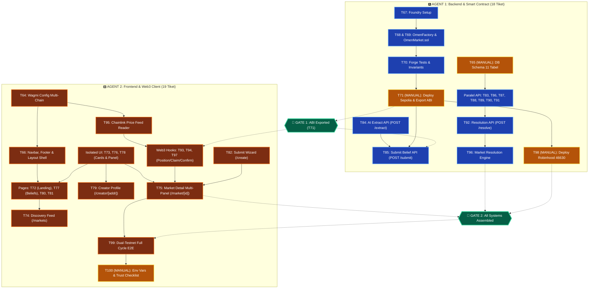

# OMEN V1: 2-Agent Zero-Clash Parallel Execution Plan

> **Node:** Omen | **Arsitektur:** V1 Social Belief Market Protocol  
> **Cakupan:** TICKET-64 s/d TICKET-100 (37 Tiket) | **Metode:** 2-Agent Domain Separation (Zero Git Conflict)

---

## 1. Filosofi & Strategi Zero-Clash (2 AI Agents)

Untuk mengeksekusi 37 tiket V1 secara maksimal dengan **2 AI Agent** berjalan bersamaan tanpa risiko konflik file (*git merge conflicts / race conditions*), repositori dipisahkan secara tegas berdasarkan **Domain Batas Fisik (*Physical Directory Isolation*)**:

```
┌──────────────────────────────────────────────────────────────────────────────────────────────────┐
│                                    PEMISAHAN DOMAIN KERJA                                        │
├──────────────────────────────────────────────────┬───────────────────────────────────────────────┤
│ 🅰️ AGENT 1: BACKEND & ON-CHAIN SPECIALIST        │ 🅱️ AGENT 2: FRONTEND & WEB3 CLIENT SPECIALIST │
│ (Smart Contract + Database + API Handlers)       │ (UI Components + Pages + Hooks + E2E Tests)   │
├──────────────────────────────────────────────────┼───────────────────────────────────────────────┤
│ 📁 omen/contracts/ (Solidity, Foundry, Tests)    │ 📁 omen/web/components/ (Semua UI Components) │
│ 📁 omen/web/db/migrations/ (SQL DDL 11 Tabel)    │ 📁 omen/web/app/ (Semua Halaman KECUALI api/) │
│ 📁 omen/web/app/api/ (Seluruh Serverless Route)  │ 📁 omen/web/hooks/ (Seluruh Wagmi Web3 Hooks) │
│ 📁 omen/web/types/database.ts & Server Helpers   │ 📁 omen/web/lib/wagmi.ts & Client Helpers     │
│ 📁 omen/web/tests/api-*.test.ts                  │ 📁 omen/web/tests/*.test.tsx & tests/e2e/     │
└──────────────────────────────────────────────────┴───────────────────────────────────────────────┘
```

> 🛡️ **Aturan Mutlak Zero-Clash:**
> - **Agent 1 DILARANG** memodifikasi file di dalam `components/`, `hooks/`, dan `app/` (selain folder `app/api/`).
> - **Agent 2 DILARANG** memodifikasi file di dalam `contracts/`, `db/migrations/`, dan `app/api/`.
> - Kedua Agent dapat bekerja **100% paralel** sejak detik pertama tanpa saling mengunci (*zero lock*).

---

## 2. Alur Eksekusi Visual 2 Agent (Continuous Parallel Flow)



---

## 3. Pembagian Tiket & Urutan Eksekusi Detail

### 🅰️ AGENT 1: Smart Contract & Core Backend (18 Tiket)
> **Mandat:** Bangun fondasi smart contract, skema database, serverless route handlers, dan mesin resolusi on-chain.

| Tahap | Tiket ID | Judul Tugas | Target File Utama | Status Blokir |
|:---:|:---:|---|---|:---:|
| **1** | **[TICKET-67](../tickets/TICKET-67-foundry-initialization-and-multichain-config.md)** | Inisialisasi Foundry & Multi-Chain Config | `contracts/foundry.toml`, `remappings.txt` | **Bisa Langsung Mulai** |
| **1** | **[TICKET-65](../tickets/TICKET-65-manual-database-schema-v1-beliefs-migration.md)** *(MANUAL)* | Migrasi Skema DB Supabase V1 (11 Tabel) | `web/db/migrations/02_v1_belief_schema.sql`, `types/database.ts` | **Bisa Langsung Mulai** |
| **2** | **[TICKET-68](../tickets/TICKET-68-omen-factory-contract-implementation.md)** | Implementasi `OmenFactory.sol` | `contracts/src/OmenFactory.sol`, interfaces | Butuh T67 |
| **2** | **[TICKET-69](../tickets/TICKET-69-omen-market-contract-implementation.md)** | Implementasi `OmenMarket.sol` | `contracts/src/OmenMarket.sol`, interfaces | Butuh T67 |
| **2** | **[TICKET-84](../tickets/TICKET-84-api-beliefs-ai-extract.md)** | AI Extraction API (`POST /api/beliefs/extract`) | `web/app/api/beliefs/extract/route.ts`, `openrouter.ts` | **Bisa Langsung Mulai** |
| **3** | **[TICKET-70](../tickets/TICKET-70-foundry-unit-testing-suite.md)** | Foundry Unit & Invariant Tests (100% Pass) | `contracts/test/OmenFactory.t.sol`, `OmenMarket.t.sol` | Butuh T68, T69 |
| **3** | **[TICKET-83](../tickets/TICKET-83-api-beliefs-get-list-and-detail.md)** | Beliefs Feed & Detail API (`GET /api/beliefs`) | `web/app/api/beliefs/route.ts`, `[id]/route.ts` | Butuh T65 |
| **3** | **[TICKET-86](../tickets/TICKET-86-api-markets-v1-get-feed-and-detail.md)** | Markets Feed API (`GET /api/markets`) | `web/app/api/markets/route.ts`, `[id]/route.ts` | Butuh T65 |
| **3** | **[TICKET-87](../tickets/TICKET-87-api-markets-positions-indexer-and-history.md)** | Positions Indexer API (`POST/GET /positions`) | `web/app/api/markets/[id]/position/route.ts` | Butuh T65 |
| **3** | **[TICKET-88](../tickets/TICKET-88-api-creator-confirmation-eip712.md)** | Creator EIP-712 Verify API (`POST /confirm`)| `web/app/api/beliefs/[id]/confirm/route.ts` | Butuh T65 |
| **3** | **[TICKET-89](../tickets/TICKET-89-api-creator-profiles-and-directory.md)** | Creators Directory API (`GET /api/creators`)| `web/app/api/creators/route.ts`, `[address]/route.ts` | Butuh T65 |
| **3** | **[TICKET-90](../tickets/TICKET-90-api-activity-feed-public.md)** | Activity Feed API (`GET /api/activity`) | `web/app/api/activity/route.ts` | Butuh T65 |
| **3** | **[TICKET-91](../tickets/TICKET-91-api-oracle-price-snapshots.md)** | Oracle Snapshot API (`POST /api/oracle/snapshot`)| `web/app/api/oracle/snapshot/route.ts` | Butuh T65 |
| **4** | **[TICKET-71](../tickets/TICKET-71-mock-smart-contract-abi-export.md)** | Setup Mock Contracts, Ekspor ABI & Lib Config | `contracts/src/`, `web/contracts/`, `web/lib/contracts.ts` | Butuh T70 |
| **4** | **[TICKET-92](../tickets/TICKET-92-api-market-resolution-v1.md)** | Market Resolution API (`POST /resolve`) | `web/app/api/markets/[id]/resolve/route.ts` | Butuh T65, T91 |
| **5** | **[TICKET-85](../tickets/TICKET-85-api-beliefs-submit-and-market-creation.md)** | Submit Belief & On-Chain Trigger API | `web/app/api/beliefs/submit/route.ts`, `factory-client.ts`| Butuh T65, T71 |
| **5** | **[TICKET-96](../tickets/TICKET-96-market-resolution-engine-oracle.md)** | Market Resolution Engine Otomatis | `web/lib/market/resolution-engine.ts` | Butuh T71, T92 |
| **6** | **[TICKET-98](../tickets/TICKET-98-manual-deploy-contracts-robinhood-chain-testnet.md)** *(MANUAL)* | Deploy ke Robinhood Chain Testnet (46630) | `contracts/script/DeployRobinhood.s.sol` | Butuh T70 |
| **6** | **[TICKET-101](../tickets/TICKET-101-manual-foundry-deployment-sepolia.md)** *(MANUAL)* | Deploy ke Ethereum Sepolia Testnet (11155111) | `contracts/script/DeploySepolia.s.sol` | Butuh T70, T100 |

---

### 🅱️ AGENT 2: Frontend UI/UX & Web3 Client (19 Tiket)
> **Mandat:** Bangun design system, layout shell, kartu komponen terisolasi, seluruh halaman feed/wizard, Wagmi hooks, dan validasi E2E.  
> 🎨 **Prinsip:** Seluruh styling OpenZeppelin dark mode, palet warna, tipografi, dan glassmorphism **WAJIB DIPERTAHANKAN**.

| Tahap | Tiket ID | Judul Tugas | Target File Utama | Status Blokir |
|:---:|:---:|---|---|:---:|
| **1** | **[TICKET-64](../tickets/TICKET-64-refactor-wagmi-config-multi-chain.md)** | Refactor Wagmi Config (Sepolia + Robinhood) | `web/lib/wagmi.ts`, `web/app/providers.tsx` | **Bisa Langsung Mulai** |
| **1** | **[TICKET-66](../tickets/TICKET-66-refactor-navbar-layout-shell-v1.md)** | Refactor Navbar, Footer & Layout Shell | `web/components/Navbar.tsx`, `Footer.tsx`, `layout.tsx` | **Bisa Langsung Mulai** |
| **1** | **[TICKET-73](../tickets/TICKET-73-belief-market-card-component.md)** | Komponen `BeliefMarketCard` (WHO/WHAT/WHEN/CONSENSUS/MONEY) | `web/components/BeliefMarketCard.tsx`, test | **Bisa Langsung Mulai** |
| **1** | **[TICKET-76](../tickets/TICKET-76-position-panel-component.md)** | Komponen `PositionPanel` (AGREE / DISAGREE Flow) | `web/components/PositionPanel.tsx`, test | **Bisa Langsung Mulai** |
| **1** | **[TICKET-78](../tickets/TICKET-78-belief-card-component.md)** | Komponen `BeliefCard` (Compact Belief & Badges) | `web/components/BeliefCard.tsx`, test | **Bisa Langsung Mulai** |
| **2** | **[TICKET-72](../tickets/TICKET-72-redesign-landing-page-social-belief-hero.md)** | Redesign Landing Page Hero Social Belief | `web/app/page.tsx`, `HeroSection.tsx`, `StatsOverview.tsx`| Butuh T66, T73 |
| **2** | **[TICKET-77](../tickets/TICKET-77-beliefs-feed-page.md)** | Halaman Katalog Beliefs (`/beliefs`) | `web/app/beliefs/page.tsx` | Butuh T78 |
| **2** | **[TICKET-80](../tickets/TICKET-80-creators-directory-page.md)** | Halaman Direktori Kreator (`/creators`) | `web/app/creators/page.tsx`, `CreatorCard.tsx` | Butuh T66 |
| **2** | **[TICKET-81](../tickets/TICKET-81-activity-feed-page.md)** | Halaman Activity Feed (`/activity`) | `web/app/activity/page.tsx`, `ActivityFeed.tsx` | Butuh T66 |
| **2** | **[TICKET-95](../tickets/TICKET-95-chainlink-oracle-price-feed-reader.md)** | Chainlink Price Feed Reader Client Helper | `web/lib/oracle/chainlink.ts` | Butuh T64 |
| **3** | **[TICKET-74](../tickets/TICKET-74-discovery-feed-markets-page.md)** | Halaman Discovery Feed (`/markets`) & Filter | `web/app/markets/page.tsx`, `DiscoveryFilter.tsx` | Butuh T73 |
| **3** | **[TICKET-79](../tickets/TICKET-79-creator-profile-page.md)** | Halaman Profil Kreator (`/creator/[address]`)| `web/app/creator/[address]/page.tsx` | Butuh T78 |
| **3** | **[TICKET-82](../tickets/TICKET-82-submit-belief-page-and-form.md)** | Halaman Submit Belief 3-Step Wizard (`/create`)| `web/app/create/page.tsx`, `BeliefSubmitForm.tsx` | Butuh T66 |
| **4** | **[TICKET-93](../tickets/TICKET-93-web3-hooks-position-claim-market.md)** | Wagmi Hooks (`usePosition`, `useClaim`, `useMarket`)| `web/hooks/usePosition.ts`, `useClaim.ts`, `useMarket.ts` | Butuh T64, **Gate 1 (T71 ABI)** |
| **4** | **[TICKET-94](../tickets/TICKET-94-web3-hook-admin-create-market.md)** | Web3 Hook (`useCreateMarket`) | `web/hooks/useCreateMarket.ts` | Butuh T64, **Gate 1 (T71 ABI)** |
| **4** | **[TICKET-97](../tickets/TICKET-97-creator-confirmation-flow-ui-and-hook.md)** | `CreatorConfirmation` UI & EIP-712 Hook | `web/components/CreatorConfirmation.tsx`, `hooks/` | Butuh T64, **Gate 1 (T71 ABI)** |
| **5** | **[TICKET-75](../tickets/TICKET-75-market-detail-multi-panel-page.md)** | Halaman Market Detail Multi-Panel (`/market/[id]`)| `web/app/market/[id]/page.tsx`, `MarketDetailPanels.tsx`| Butuh T76, T93 |
| **6** | **[TICKET-99](../tickets/TICKET-99-dual-testnet-e2e-validation.md)** | Dual-Testnet Full Cycle E2E Test Suite | `web/tests/e2e/belief-market-cycle.test.tsx` | Butuh **Gate 2 (All Assembled)** |
| **6** | **[TICKET-100](../tickets/TICKET-100-manual-environment-variables-and-trust-checklist.md)** *(MANUAL)* | Environment Variables & Final Trust Checklist | `web/.env.example`, `contracts/.env.example`, `README.md`| Butuh T99 |

---

## 4. Dua Titik Jabat Tangan (Hand-off Sync Protocol)

Hanya ada **2 momen komunikasi** yang dibutuhkan antara kedua agent:

### 🤝 Sync Point 1: Penyerahan ABI Kontrak Sepolia (Setelah Agent 1 selesai T71)
1. **Pemicu:** Agent 1 selesai mengeksekusi `TICKET-71` dan file ABI `omen/web/contracts/OmenFactory.json` serta `omen/web/contracts/OmenMarket.json` telah terbentuk.
2. **Dampak ke Agent 2:** Agent 2 sekarang dapat melanjutkan pengerjaan Web3 Hooks (`TICKET-93`, `TICKET-94`, `TICKET-97`) dan halaman Market Detail (`TICKET-75`).

### 🤝 Sync Point 2: Konvergensi Pengujian E2E (Setelah Semua Komponen Terpasang)
1. **Pemicu:** Agent 1 telah menyelesaikan seluruh API & kontrak Robinhood (`TICKET-98`), dan Agent 2 telah menyelesaikan seluruh UI & Hooks (`TICKET-75, 97`).
2. **Dampak:** Agent 2 mengeksekusi `TICKET-99` (E2E Test Suite) untuk memvalidasi siklus penuh di browser/simulator pada kedua chain.
3. **Penyelesaian:** Developer dan Agent 2 menyelesaikan `TICKET-100` (Review Final).

---

## 5. Panduan Prompt Eksekusi untuk Developer

Jalankan 2 sesi / window terpisah untuk masing-masing agent dengan menyalin prompt instruksi berikut:

### 📝 Prompt untuk Window Sesi AGENT 1 (Backend & Blockchain):
```text
Kamu bertindak sebagai AGENT 1 (Backend & Smart Contract Specialist) sesuai panduan di @omen-ai-orchestrator/nodes/omen/docs/v1-parallel-execution-plan.md.

Lingkup kerjamu DIBATASI HANYA pada direktori:
- omen/contracts/ (Solidity, Foundry, Tests, Deploy scripts)
- omen/web/db/ (SQL migrations)
- omen/web/app/api/ (Serverless Route Handlers)
- omen/web/types/database.ts & server helpers
- omen/web/tests/api-*.test.ts

DILARANG KERAS mengedit file di components/, hooks/, atau app/ selain folder api/.

Misi tugasmu adalah mengeksekusi 18 tiket berikut secara berurutan:
TICKET-67 -> TICKET-65 (MANUAL) -> TICKET-68 -> TICKET-69 -> TICKET-84 -> TICKET-70 -> TICKET-83 -> TICKET-86 -> TICKET-87 -> TICKET-88 -> TICKET-89 -> TICKET-90 -> TICKET-91 -> TICKET-71 (MANUAL) -> TICKET-92 -> TICKET-85 -> TICKET-96 -> TICKET-98 (MANUAL).

Mulai sekarang dari TICKET-67 dan TICKET-65.
```

### 📝 Prompt untuk Window Sesi AGENT 2 (Frontend & Web3 Client):
```text
Kamu bertindak sebagai AGENT 2 (Frontend UI/UX & Web3 Client Specialist) sesuai panduan di @omen-ai-orchestrator/nodes/omen/docs/v1-parallel-execution-plan.md.

Lingkup kerjamu DIBATASI HANYA pada direktori:
- omen/web/components/ (Semua komponen UI)
- omen/web/app/ (Halaman web KECUALI folder api/)
- omen/web/hooks/ (Seluruh Wagmi Web3 hooks)
- omen/web/lib/wagmi.ts & client helpers
- omen/web/tests/*.test.tsx & web/tests/e2e/

DILARANG KERAS mengedit file di contracts/, db/migrations/, atau app/api/.
WAJIB MEMPERTAHANKAN seluruh tema OpenZeppelin dark mode, palet warna, tipografi, dan style existing (jangan rebuild dari nol).

Misi tugasmu adalah mengeksekusi 19 tiket berikut secara berurutan:
TICKET-64 -> TICKET-66 -> TICKET-73 -> TICKET-76 -> TICKET-78 -> TICKET-72 -> TICKET-77 -> TICKET-80 -> TICKET-81 -> TICKET-95 -> TICKET-74 -> TICKET-79 -> TICKET-82 -> (Tunggu ABI Kontrak T71) -> TICKET-93 -> TICKET-94 -> TICKET-97 -> TICKET-75 -> TICKET-99 -> TICKET-100 (MANUAL).

Mulai sekarang dari TICKET-64 dan TICKET-66.
```
